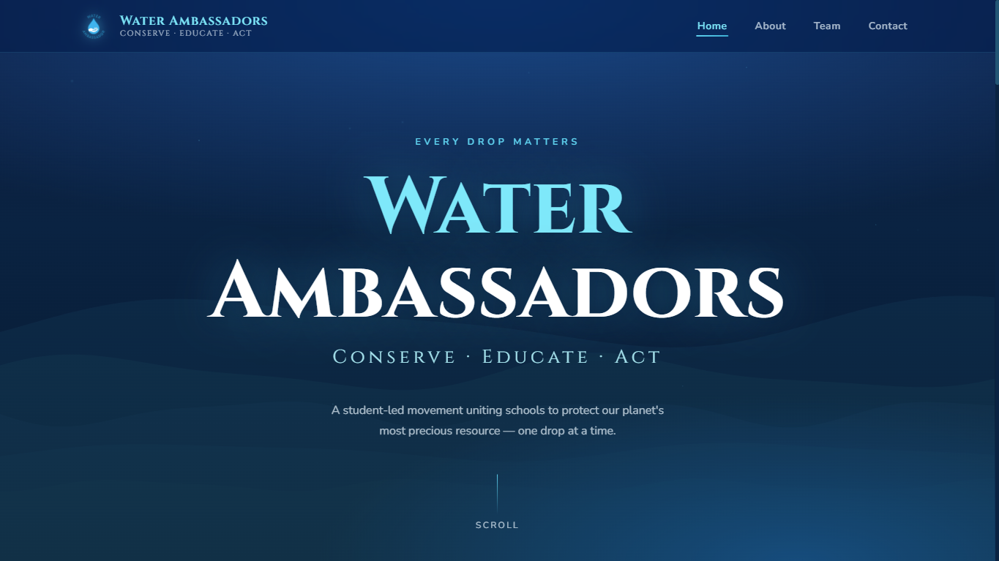

# Jr. Water Ambassadors Showcase Website

A showcase website for the efforts of the students participating in the Jr. Water Ambassadors program at my school.

## Live Website

[Visit Website](https://waterambassadors.github.io)

## Overview

The website highlights the vision and mission of the Jr. Water Ambassadors, containing pictures of lake cleanup drives and awareness posters.

## Features

- Showcase of lake cleanup drives
- Showcase of digital awareness posters
- Contact form

## Technologies

- HTML
- CSS
- JavaScript

## Screenshots

## Future Improvements

- Create a more unique visual identity
- Create a CMS system for participating students/teachers to easily update.

## Status

Work in Progress

---

Created by [rishitc17](https://github.com/rishitc17)
